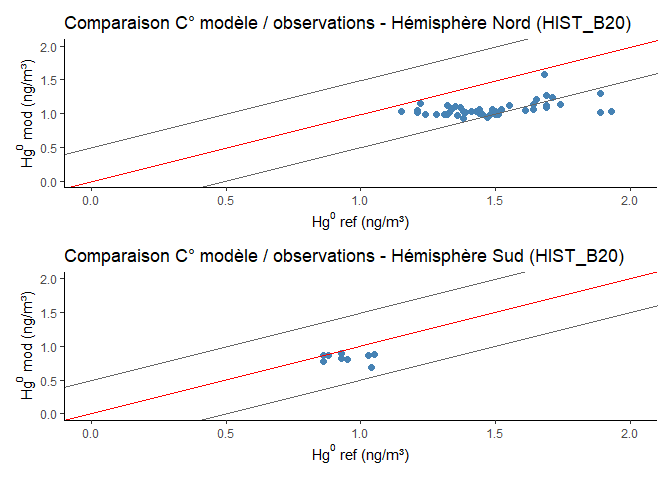
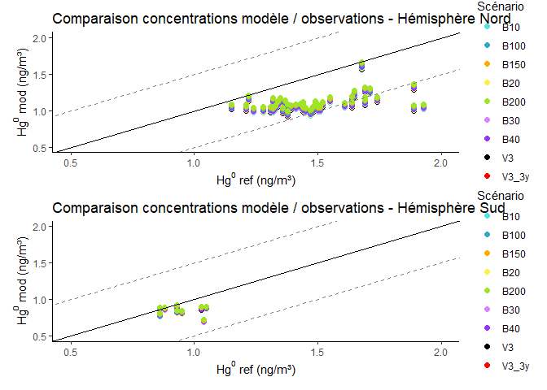

Comparaison modèle vs. observations Hg0
================
Martin Colomb
2025-07-02

# Chargement des packages

``` r
library(dplyr)
library(ggplot2)
library(lubridate)
library(ncdf4)
library(patchwork)
library(geosphere)
```

# Lecture des données de surface de cellule

``` r
chem<-("C:/Users/colom/Desktop/STAGE/data/clean_mod_data/")
gboxarea <- nc_open(file.path(chem, "GEOSChem_2x25_gboxarea.nc"))
area <- ncvar_get(gboxarea, "cell_area")
```

# Constantes et conversion

``` r
s_in_yr = 365.2425 * 24 * 3600
MW_Hg = 200.59
avo = 6.02e23
g_kg = 1e-3
cm2_m2 = 1e4
unit_conv_dd = MW_Hg / avo * g_kg * cm2_m2 * s_in_yr * area
M_Hg <- 200.59
R <- 8.3145
P <- 101325
T <- 298.15
```

# Concentrations - scénario B25

``` r
chem_B25 <- "C:/Users/colom/Desktop/STAGE/data/clean_mod_data/14_3_1/HIST_B25"
species_conc_B25 <- nc_open(file.path(chem_B25, "GEOSChem.SpeciesConc.2015_m.nc4"))
conc_hg0_B25 <- ncvar_get(species_conc_B25, "SpeciesConcVV_Hg0")
conc_hg0_B25 <- conc_hg0_B25[,,1,]
time_raw <- ncvar_get(species_conc_B25, "time")
origin_time <- as.POSIXct("2015-01-01 00:00:00", tz = "UTC")
time <- origin_time + time_raw * 60
days_in_months <- days_in_month(time)
weights <- days_in_months / sum(days_in_months)
weighted_avg <- function(x) sum(x * weights)
lon <- seq(-180, 180, length.out = 144)
lat <- seq(-90, 90, length.out = 91)
conc_hg0_B25 <- apply(conc_hg0_B25, MARGIN = c(1, 2), FUN = weighted_avg)
conc_hg0_B25 <- conc_hg0_B25 * P * (M_Hg / (R * T)) * 1e9
df_mrtn_B25 <- expand.grid(lon = lon, lat = lat) %>% mutate(conc = as.vector(conc_hg0_B25))
```

# Lecture des observations

``` r
chem_ref <- "C:/Users/colom/Desktop/STAGE/data/clean_mod_data/ref_wd_con_hg"
ref_hg0_1 <- read.csv2(file.path(chem_ref, "Hg0_annual_2013-2015_Apr13_2024.csv"), sep = ",", header = TRUE)
colnames(ref_hg0_1) <- as.character(unlist(ref_hg0_1[1, ]))
ref_hg0_1 <- ref_hg0_1[-1, ]
ref_hg0_info <- read.csv2(file.path(chem_ref, "Hg0_annual_2013-2015_references_Apr13_2024.csv"), sep = ",")
ref_hg0_1$Lat <- as.numeric(ref_hg0_1$Lat)
ref_hg0_1$Lon <- as.numeric(ref_hg0_1$Lon)
ref_hg0_1$Hg0 <- as.numeric(ref_hg0_1$Hg0)
```

# Attribution concentration modélisée aux stations

``` r
get_nearest_conc <- function(station_lon, station_lat, grid_df) {
  candidates <- grid_df %>% filter(abs(lon - station_lon) < 2, abs(lat - station_lat) < 2)
  if (nrow(candidates) == 0) return(NA)
  station_coords <- matrix(c(station_lon, station_lat), ncol = 2)
  candidate_coords <- as.matrix(candidates[, c("lon", "lat")])
  distances <- distHaversine(station_coords, candidate_coords)
  nearest_index <- which.min(distances)
  return(candidates$conc[nearest_index])
}

ref_hg0_1$conc_model_mrtn <- mapply(get_nearest_conc, ref_hg0_1$Lon, ref_hg0_1$Lat, MoreArgs = list(grid_df = df_mrtn_B25))
```

# Comparaison graphique - Hémisphères

``` r
ref_hg0_1_hemiN <- ref_hg0_1[ref_hg0_1$Lat > 0, ]
ref_hg0_1_hemiS <- ref_hg0_1[ref_hg0_1$Lat < 0, ]

plot_comparaison <- function(df, title) {
  ggplot(df, aes(x = Hg0, y = conc_model_mrtn)) +
    geom_point(color = "steelblue", size = 2) +
    geom_abline(slope = 1, intercept = 0, color = "red") +
    geom_abline(slope = 1, intercept = 0.5, color = "gray40") +
    geom_abline(slope = 1, intercept = -0.5, color = "gray40") +
    coord_cartesian(xlim = c(0, 2), ylim = c(0, 2)) +
    labs(title = title,
         x = expression(paste("Hg"^0, " ref (ng/m³)")),
         y = expression(paste("Hg"^0, " mod (ng/m³)"))) +
    theme_classic()
}

plot_comparaison(ref_hg0_1_hemiN, "Comparaison Hémisphère Nord") +
  plot_comparaison(ref_hg0_1_hemiS, "Comparaison Hémisphère Sud") +
  plot_layout(nrow = 2)
```

<!-- -->

# Comparaison multi-scénarios

``` r
scenarios <- c("V3","V3_3y" ,"B10",  "B20",  "B30", "B40", "B100", "B150", "B200" )
chem_base <- "C:/Users/colom/Desktop/STAGE/data/clean_mod_data/14_3_1/HIST_"
all_results <- data.frame()

species_conc_B30 <- nc_open(file.path("C:/Users/colom/Desktop/STAGE/data/clean_mod_data/14_3_1/HIST_B30", "GEOSChem.SpeciesConc.2015_m.nc4"))
time_raw <- ncvar_get(species_conc_B30, "time")
nc_close(species_conc_B30)
time <- origin_time + time_raw * 60
days_in_months <- days_in_month(time)
weights <- days_in_months / sum(days_in_months)

for (sc in scenarios) {
  cat("Traitement du scénario :", sc, "\n")
  chem_path <- paste0(chem_base, sc)
  file_path <- file.path(chem_path, "GEOSChem.SpeciesConc.2015_m.nc4")
  nc <- nc_open(file_path)
  conc_hg0 <- ncvar_get(nc, "SpeciesConcVV_Hg0")
  nc_close(nc)
  if (length(dim(conc_hg0)) == 4) {
    conc_hg0 <- conc_hg0[,,1,]
  }
  conc_hg0 <- apply(conc_hg0, MARGIN = c(1, 2), FUN = weighted_avg)
  conc_hg0 <- conc_hg0 * P * (M_Hg / (R * T)) * 1e9
  df_grid <- expand.grid(lon = lon, lat = lat) %>% mutate(conc = as.vector(conc_hg0))
  ref_copy <- ref_hg0_1
  ref_copy$conc_model <- mapply(get_nearest_conc, ref_copy$Lon, ref_copy$Lat, MoreArgs = list(grid_df = df_grid))
  ref_copy$scenario <- sc
  all_results <- bind_rows(all_results, ref_copy)
}
```

    ## Traitement du scénario : V3 
    ## Traitement du scénario : V3_3y 
    ## Traitement du scénario : B10 
    ## Traitement du scénario : B20 
    ## Traitement du scénario : B30 
    ## Traitement du scénario : B40 
    ## Traitement du scénario : B100 
    ## Traitement du scénario : B150 
    ## Traitement du scénario : B200

``` r
res_N <- all_results %>% filter(Lat > 0)
res_S <- all_results %>% filter(Lat < 0)
palette_b <- c("V3" = "black","V3_3y" = "red","B10" = "#52e3e1" ,"B20" = "#fdf148" , "B30" ="#d883ff" , "B40" ="#9336fd", "B100" = "#33a8c7" , "B150" = "#ffab00", "B200" = "#a0e426" )

plot_multi <- function(df, title) {
  ggplot(df, aes(x = Hg0, y = conc_model, color = scenario)) +
    geom_point(size = 2) +
    geom_abline(slope = 1, intercept = 0, color = "black") +
    geom_abline(slope = 1, intercept = 0.5, color = "gray50", linetype = "dashed") +
    geom_abline(slope = 1, intercept = -0.5, color = "gray50", linetype = "dashed") +
    scale_color_manual(values = palette_b) +
    coord_cartesian(xlim = c(0.5, 2), ylim = c(0.5, 2)) +
    labs(title = title,
         x = expression(paste("Hg"^0, " ref (ng/m³)")),
         y = expression(paste("Hg"^0, " mod (ng/m³)")),
         color = "Scénario") +
    theme_classic()
}

plot_multi(res_N, "Modèle vs obs - Nord") +
  plot_multi(res_S, "Modèle vs obs - Sud") +
  plot_layout(nrow = 2)
```

<!-- -->
