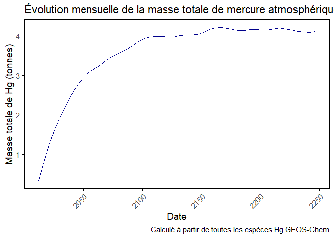

Evol_mass_2012_2015
================
Martin Colomb
2025-08-26

# Chargement des packages

``` r
library(dplyr)
library(ggplot2)
library(lubridate)
library(ncdf4)
library(stringr)
library(tibble)
library(writexl)
```

# Lecture des données

``` r
chem_hist<-"C:/Users/colom/Desktop/STAGE/data/clean_mod_data/14_3_1"
statemet<-nc_open(file.path(chem_hist, "GEOSChem.StateMet.2014_2015_m.nc4"))


Met_AD<-ncvar_get(statemet, "Met_AD")  #Met_AD (Dry air mass kg)
mean_Met_AD <- apply(Met_AD, c(1,2,3), mean, na.rm = TRUE)


kg_Mg = 1e-3
MW_Hg = 200.59
avo = 6.02e23
g_kg = 1e-3
cm2_m2 = 1e4
M_Hg <- 0.20059
M_air <- 0.028964
```

# The conversion formula is:

        mol species                g/mol species
        ----------- * kg dry air * -------------
        mol dry air                g/mol dry air

        = volume mixing ratio * dry air mass * MW species / MW dry air

        = kg species
        
            
        MW dry air is defined as 28.9644 g/mol
        https://github.com/geoschem/geos-chem/blob/4722f288e90291ba904222f4bbe4fc216d17c34a/Headers/physconstants.F90#L26

        
        

``` r
conc_2012_2015<-nc_open(file.path(chem_hist, "HIST_4y/GEOSChem.SpeciesConc.2012_2015_m.nc4"))
print(conc_2012_2015)
```

    ## File C:/Users/colom/Desktop/STAGE/data/clean_mod_data/14_3_1/HIST_4y/GEOSChem.SpeciesConc.2012_2015_m.nc4 (NC_FORMAT_NETCDF4_CLASSIC):
    ## 
    ##      49 variables (excluding dimension variables):
    ##         double time_bnds[bnds,time]   (Chunking: [2,1])  
    ##         double lon_bnds[bnds,lon]   (Contiguous storage)  
    ##         double lat_bnds[bnds,lat]   (Contiguous storage)  
    ##         double lev_bnds[bnds,lev]   (Contiguous storage)  
    ##             standard_name: atmosphere_hybrid_sigma_pressure_coordinate
    ##             units: level
    ##             formula_terms: ap: ap_bnds b: b_bnds ps: ps
    ##         float AREA[lon,lat]   (Chunking: [144,91])  
    ##             long_name: Surface area
    ##             units: m2
    ##             cell_methods: time: mean
    ##         float SpeciesConcVV_CH4[lon,lat,lev,time]   (Chunking: [144,91,1,1])  
    ##             long_name: Concentration of species CH4
    ##             units: mol mol-1 dry
    ##             cell_methods: time: mean
    ##             averaging_method: time-averaged
    ##         float SpeciesConcVV_CO[lon,lat,lev,time]   (Chunking: [144,91,1,1])  
    ##             long_name: Concentration of species CO
    ##             units: mol mol-1 dry
    ##             cell_methods: time: mean
    ##             averaging_method: time-averaged
    ##         float SpeciesConcVV_ClO[lon,lat,lev,time]   (Chunking: [144,91,1,1])  
    ##             long_name: Concentration of species ClO
    ##             units: mol mol-1 dry
    ##             cell_methods: time: mean
    ##             averaging_method: time-averaged
    ##         float SpeciesConcVV_BrO[lon,lat,lev,time]   (Chunking: [144,91,1,1])  
    ##             long_name: Concentration of species BrO
    ##             units: mol mol-1 dry
    ##             cell_methods: time: mean
    ##             averaging_method: time-averaged
    ##         float SpeciesConcVV_HO2[lon,lat,lev,time]   (Chunking: [144,91,1,1])  
    ##             long_name: Concentration of species HO2
    ##             units: mol mol-1 dry
    ##             cell_methods: time: mean
    ##             averaging_method: time-averaged
    ##         float SpeciesConcVV_O3[lon,lat,lev,time]   (Chunking: [144,91,1,1])  
    ##             long_name: Concentration of species O3
    ##             units: mol mol-1 dry
    ##             cell_methods: time: mean
    ##             averaging_method: time-averaged
    ##         float SpeciesConcVV_NO[lon,lat,lev,time]   (Chunking: [144,91,1,1])  
    ##             long_name: Concentration of species NO
    ##             units: mol mol-1 dry
    ##             cell_methods: time: mean
    ##             averaging_method: time-averaged
    ##         float SpeciesConcVV_NO2[lon,lat,lev,time]   (Chunking: [144,91,1,1])  
    ##             long_name: Concentration of species NO2
    ##             units: mol mol-1 dry
    ##             cell_methods: time: mean
    ##             averaging_method: time-averaged
    ##         float SpeciesConcVV_OH[lon,lat,lev,time]   (Chunking: [144,91,1,1])  
    ##             long_name: Concentration of species OH
    ##             units: mol mol-1 dry
    ##             cell_methods: time: mean
    ##             averaging_method: time-averaged
    ##         float SpeciesConcVV_Cl[lon,lat,lev,time]   (Chunking: [144,91,1,1])  
    ##             long_name: Concentration of species Cl
    ##             units: mol mol-1 dry
    ##             cell_methods: time: mean
    ##             averaging_method: time-averaged
    ##         float SpeciesConcVV_Br[lon,lat,lev,time]   (Chunking: [144,91,1,1])  
    ##             long_name: Concentration of species Br
    ##             units: mol mol-1 dry
    ##             cell_methods: time: mean
    ##             averaging_method: time-averaged
    ##         float SpeciesConcVV_HgClO[lon,lat,lev,time]   (Chunking: [144,91,1,1])  
    ##             long_name: Concentration of species HgClO
    ##             units: mol mol-1 dry
    ##             cell_methods: time: mean
    ##             averaging_method: time-averaged
    ##         float SpeciesConcVV_HgBrO[lon,lat,lev,time]   (Chunking: [144,91,1,1])  
    ##             long_name: Concentration of species HgBrO
    ##             units: mol mol-1 dry
    ##             cell_methods: time: mean
    ##             averaging_method: time-averaged
    ##         float SpeciesConcVV_HgOHO[lon,lat,lev,time]   (Chunking: [144,91,1,1])  
    ##             long_name: Concentration of species HgOHO
    ##             units: mol mol-1 dry
    ##             cell_methods: time: mean
    ##             averaging_method: time-averaged
    ##         float SpeciesConcVV_PHg2Cl[lon,lat,lev,time]   (Chunking: [144,91,1,1])  
    ##             long_name: Concentration of species PHg2Cl
    ##             units: mol mol-1 dry
    ##             cell_methods: time: mean
    ##             averaging_method: time-averaged
    ##         float SpeciesConcVV_PHg2OH[lon,lat,lev,time]   (Chunking: [144,91,1,1])  
    ##             long_name: Concentration of species PHg2OH
    ##             units: mol mol-1 dry
    ##             cell_methods: time: mean
    ##             averaging_method: time-averaged
    ##         float SpeciesConcVV_PHg2Br[lon,lat,lev,time]   (Chunking: [144,91,1,1])  
    ##             long_name: Concentration of species PHg2Br
    ##             units: mol mol-1 dry
    ##             cell_methods: time: mean
    ##             averaging_method: time-averaged
    ##         float SpeciesConcVV_PHg0[lon,lat,lev,time]   (Chunking: [144,91,1,1])  
    ##             long_name: Concentration of species PHg0
    ##             units: mol mol-1 dry
    ##             cell_methods: time: mean
    ##             averaging_method: time-averaged
    ##         float SpeciesConcVV_PHg2[lon,lat,lev,time]   (Chunking: [144,91,1,1])  
    ##             long_name: Concentration of species PHg2
    ##             units: mol mol-1 dry
    ##             cell_methods: time: mean
    ##             averaging_method: time-averaged
    ##         float SpeciesConcVV_Hg2STRP[lon,lat,lev,time]   (Chunking: [144,91,1,1])  
    ##             long_name: Concentration of species Hg2STRP
    ##             units: mol mol-1 dry
    ##             cell_methods: time: mean
    ##             averaging_method: time-averaged
    ##         float SpeciesConcVV_Hg2ORGP[lon,lat,lev,time]   (Chunking: [144,91,1,1])  
    ##             long_name: Concentration of species Hg2ORGP
    ##             units: mol mol-1 dry
    ##             cell_methods: time: mean
    ##             averaging_method: time-averaged
    ##         float SpeciesConcVV_Hg2ClP[lon,lat,lev,time]   (Chunking: [144,91,1,1])  
    ##             long_name: Concentration of species Hg2ClP
    ##             units: mol mol-1 dry
    ##             cell_methods: time: mean
    ##             averaging_method: time-averaged
    ##         float SpeciesConcVV_HgCl2[lon,lat,lev,time]   (Chunking: [144,91,1,1])  
    ##             long_name: Concentration of species HgCl2
    ##             units: mol mol-1 dry
    ##             cell_methods: time: mean
    ##             averaging_method: time-averaged
    ##         float SpeciesConcVV_HgOHOH[lon,lat,lev,time]   (Chunking: [144,91,1,1])  
    ##             long_name: Concentration of species HgOHOH
    ##             units: mol mol-1 dry
    ##             cell_methods: time: mean
    ##             averaging_method: time-averaged
    ##         float SpeciesConcVV_HgOHBrO[lon,lat,lev,time]   (Chunking: [144,91,1,1])  
    ##             long_name: Concentration of species HgOHBrO
    ##             units: mol mol-1 dry
    ##             cell_methods: time: mean
    ##             averaging_method: time-averaged
    ##         float SpeciesConcVV_HgOHClO[lon,lat,lev,time]   (Chunking: [144,91,1,1])  
    ##             long_name: Concentration of species HgOHClO
    ##             units: mol mol-1 dry
    ##             cell_methods: time: mean
    ##             averaging_method: time-averaged
    ##         float SpeciesConcVV_HgOHHO2[lon,lat,lev,time]   (Chunking: [144,91,1,1])  
    ##             long_name: Concentration of species HgOHHO2
    ##             units: mol mol-1 dry
    ##             cell_methods: time: mean
    ##             averaging_method: time-averaged
    ##         float SpeciesConcVV_HgOHNO2[lon,lat,lev,time]   (Chunking: [144,91,1,1])  
    ##             long_name: Concentration of species HgOHNO2
    ##             units: mol mol-1 dry
    ##             cell_methods: time: mean
    ##             averaging_method: time-averaged
    ##         float SpeciesConcVV_HgOH[lon,lat,lev,time]   (Chunking: [144,91,1,1])  
    ##             long_name: Concentration of species HgOH
    ##             units: mol mol-1 dry
    ##             cell_methods: time: mean
    ##             averaging_method: time-averaged
    ##         float SpeciesConcVV_HgClOH[lon,lat,lev,time]   (Chunking: [144,91,1,1])  
    ##             long_name: Concentration of species HgClOH
    ##             units: mol mol-1 dry
    ##             cell_methods: time: mean
    ##             averaging_method: time-averaged
    ##         float SpeciesConcVV_HgClBr[lon,lat,lev,time]   (Chunking: [144,91,1,1])  
    ##             long_name: Concentration of species HgClBr
    ##             units: mol mol-1 dry
    ##             cell_methods: time: mean
    ##             averaging_method: time-averaged
    ##         float SpeciesConcVV_HgClBrO[lon,lat,lev,time]   (Chunking: [144,91,1,1])  
    ##             long_name: Concentration of species HgClBrO
    ##             units: mol mol-1 dry
    ##             cell_methods: time: mean
    ##             averaging_method: time-averaged
    ##         float SpeciesConcVV_HgClClO[lon,lat,lev,time]   (Chunking: [144,91,1,1])  
    ##             long_name: Concentration of species HgClClO
    ##             units: mol mol-1 dry
    ##             cell_methods: time: mean
    ##             averaging_method: time-averaged
    ##         float SpeciesConcVV_HgClHO2[lon,lat,lev,time]   (Chunking: [144,91,1,1])  
    ##             long_name: Concentration of species HgClHO2
    ##             units: mol mol-1 dry
    ##             cell_methods: time: mean
    ##             averaging_method: time-averaged
    ##         float SpeciesConcVV_HgClNO2[lon,lat,lev,time]   (Chunking: [144,91,1,1])  
    ##             long_name: Concentration of species HgClNO2
    ##             units: mol mol-1 dry
    ##             cell_methods: time: mean
    ##             averaging_method: time-averaged
    ##         float SpeciesConcVV_HgCl[lon,lat,lev,time]   (Chunking: [144,91,1,1])  
    ##             long_name: Concentration of species HgCl
    ##             units: mol mol-1 dry
    ##             cell_methods: time: mean
    ##             averaging_method: time-averaged
    ##         float SpeciesConcVV_HgBr2[lon,lat,lev,time]   (Chunking: [144,91,1,1])  
    ##             long_name: Concentration of species HgBr2
    ##             units: mol mol-1 dry
    ##             cell_methods: time: mean
    ##             averaging_method: time-averaged
    ##         float SpeciesConcVV_HgBrOH[lon,lat,lev,time]   (Chunking: [144,91,1,1])  
    ##             long_name: Concentration of species HgBrOH
    ##             units: mol mol-1 dry
    ##             cell_methods: time: mean
    ##             averaging_method: time-averaged
    ##         float SpeciesConcVV_HgBrClO[lon,lat,lev,time]   (Chunking: [144,91,1,1])  
    ##             long_name: Concentration of species HgBrClO
    ##             units: mol mol-1 dry
    ##             cell_methods: time: mean
    ##             averaging_method: time-averaged
    ##         float SpeciesConcVV_HgBrBrO[lon,lat,lev,time]   (Chunking: [144,91,1,1])  
    ##             long_name: Concentration of species HgBrBrO
    ##             units: mol mol-1 dry
    ##             cell_methods: time: mean
    ##             averaging_method: time-averaged
    ##         float SpeciesConcVV_HgBrHO2[lon,lat,lev,time]   (Chunking: [144,91,1,1])  
    ##             long_name: Concentration of species HgBrHO2
    ##             units: mol mol-1 dry
    ##             cell_methods: time: mean
    ##             averaging_method: time-averaged
    ##         float SpeciesConcVV_HgBrNO2[lon,lat,lev,time]   (Chunking: [144,91,1,1])  
    ##             long_name: Concentration of species HgBrNO2
    ##             units: mol mol-1 dry
    ##             cell_methods: time: mean
    ##             averaging_method: time-averaged
    ##         float SpeciesConcVV_HgBr[lon,lat,lev,time]   (Chunking: [144,91,1,1])  
    ##             long_name: Concentration of species HgBr
    ##             units: mol mol-1 dry
    ##             cell_methods: time: mean
    ##             averaging_method: time-averaged
    ##         float SpeciesConcVV_Hg0[lon,lat,lev,time]   (Chunking: [144,91,1,1])  
    ##             long_name: Concentration of species Hg0
    ##             units: mol mol-1 dry
    ##             cell_methods: time: mean
    ##             averaging_method: time-averaged
    ## 
    ##      5 dimensions:
    ##         time  Size:48   *** is unlimited *** 
    ##             standard_name: time
    ##             long_name: Time
    ##             bounds: time_bnds
    ##             units: minutes since 2012-01-01 00:00:00
    ##             calendar: gregorian
    ##             axis: T
    ##         bnds  Size:2 (no dimvar)
    ##         lon  Size:144 
    ##             standard_name: longitude
    ##             long_name: Longitude
    ##             units: degrees_east
    ##             axis: X
    ##             bounds: lon_bnds
    ##         lat  Size:91 
    ##             standard_name: latitude
    ##             long_name: Latitude
    ##             units: degrees_north
    ##             axis: Y
    ##             bounds: lat_bnds
    ##         lev  Size:47 
    ##             standard_name: atmosphere_hybrid_sigma_pressure_coordinate
    ##             axis: Z
    ##             positive: down
    ##             long_name: hybrid sigma pressure coordinate
    ##             units: level
    ##             formula_terms: ap: ap b: b ps: ps
    ##             bounds: lev_bnds
    ## 
    ##     13 global attributes:
    ##         CDI: Climate Data Interface version 2.1.1 (https://mpimet.mpg.de/cdi)
    ##         Conventions: CF-1.6
    ##         title: GEOS-Chem diagnostic collection: SpeciesConc
    ##         history: Thu Jul 17 14:31:15 2025: cdo monmean GEOSChem.SpeciesConc.2012_2015.nc4 GEOSChem.SpeciesConc.2012_2015_m.nc4
    ## Thu Jul 17 14:28:55 2025: cdo mergetime GEOSChem.SpeciesConc.20120101_0000z.nc4 GEOSChem.SpeciesConc.20120201_0000z.nc4 GEOSChem.SpeciesConc.20120301_0000z.nc4 GEOSChem.SpeciesConc.20120401_0000z.nc4 GEOSChem.SpeciesConc.20120501_0000z.nc4 GEOSChem.SpeciesConc.20120601_0000z.nc4 GEOSChem.SpeciesConc.20120701_0000z.nc4 GEOSChem.SpeciesConc.20120801_0000z.nc4 GEOSChem.SpeciesConc.20120901_0000z.nc4 GEOSChem.SpeciesConc.20121001_0000z.nc4 GEOSChem.SpeciesConc.20121101_0000z.nc4 GEOSChem.SpeciesConc.20121201_0000z.nc4 GEOSChem.SpeciesConc.20130101_0000z.nc4 GEOSChem.SpeciesConc.20130201_0000z.nc4 GEOSChem.SpeciesConc.20130301_0000z.nc4 GEOSChem.SpeciesConc.20130401_0000z.nc4 GEOSChem.SpeciesConc.20130501_0000z.nc4 GEOSChem.SpeciesConc.20130601_0000z.nc4 GEOSChem.SpeciesConc.20130701_0000z.nc4 GEOSChem.SpeciesConc.20130801_0000z.nc4 GEOSChem.SpeciesConc.20130901_0000z.nc4 GEOSChem.SpeciesConc.20131001_0000z.nc4 GEOSChem.SpeciesConc.20131101_0000z.nc4 GEOSChem.SpeciesConc.20131201_0000z.nc4 GEOSChem.SpeciesConc.20140101_0000z.nc4 GEOSChem.SpeciesConc.20140201_0000z.nc4 GEOSChem.SpeciesConc.20140301_0000z.nc4 GEOSChem.SpeciesConc.20140401_0000z.nc4 GEOSChem.SpeciesConc.20140501_0000z.nc4 GEOSChem.SpeciesConc.20140601_0000z.nc4 GEOSChem.SpeciesConc.20140701_0000z.nc4 GEOSChem.SpeciesConc.20140801_0000z.nc4 GEOSChem.SpeciesConc.20140901_0000z.nc4 GEOSChem.SpeciesConc.20141001_0000z.nc4 GEOSChem.SpeciesConc.20141101_0000z.nc4 GEOSChem.SpeciesConc.20141201_0000z.nc4 GEOSChem.SpeciesConc.20150101_0000z.nc4 GEOSChem.SpeciesConc.20150201_0000z.nc4 GEOSChem.SpeciesConc.20150301_0000z.nc4 GEOSChem.SpeciesConc.20150401_0000z.nc4 GEOSChem.SpeciesConc.20150501_0000z.nc4 GEOSChem.SpeciesConc.20150601_0000z.nc4 GEOSChem.SpeciesConc.20150701_0000z.nc4 GEOSChem.SpeciesConc.20150801_0000z.nc4 GEOSChem.SpeciesConc.20150901_0000z.nc4 GEOSChem.SpeciesConc.20151001_0000z.nc4 GEOSChem.SpeciesConc.20151101_0000z.nc4 GEOSChem.SpeciesConc.20151201_0000z.nc4 GEOSChem.SpeciesConc.2012_2015.nc4
    ##         format: NetCDF-4
    ##         conventions: COARDS
    ##         ProdDateTime: 
    ##         reference: www.geos-chem.org; wiki.geos-chem.org
    ##         contact: GEOS-Chem Support Team (geos-chem-support@g.harvard.edu)
    ##         simulation_start_date_and_time: 2012-01-01 00:00:00z
    ##         simulation_end_date_and_time: 2013-01-01 00:00:00z
    ##         frequency: mon
    ##         CDO: Climate Data Operators version 2.1.1 (https://mpimet.mpg.de/cdo)

``` r
variable_names <- names(conc_2012_2015$var)
print(variable_names)
```

    ##  [1] "time_bnds"             "lon_bnds"              "lat_bnds"              "lev_bnds"             
    ##  [5] "AREA"                  "SpeciesConcVV_CH4"     "SpeciesConcVV_CO"      "SpeciesConcVV_ClO"    
    ##  [9] "SpeciesConcVV_BrO"     "SpeciesConcVV_HO2"     "SpeciesConcVV_O3"      "SpeciesConcVV_NO"     
    ## [13] "SpeciesConcVV_NO2"     "SpeciesConcVV_OH"      "SpeciesConcVV_Cl"      "SpeciesConcVV_Br"     
    ## [17] "SpeciesConcVV_HgClO"   "SpeciesConcVV_HgBrO"   "SpeciesConcVV_HgOHO"   "SpeciesConcVV_PHg2Cl" 
    ## [21] "SpeciesConcVV_PHg2OH"  "SpeciesConcVV_PHg2Br"  "SpeciesConcVV_PHg0"    "SpeciesConcVV_PHg2"   
    ## [25] "SpeciesConcVV_Hg2STRP" "SpeciesConcVV_Hg2ORGP" "SpeciesConcVV_Hg2ClP"  "SpeciesConcVV_HgCl2"  
    ## [29] "SpeciesConcVV_HgOHOH"  "SpeciesConcVV_HgOHBrO" "SpeciesConcVV_HgOHClO" "SpeciesConcVV_HgOHHO2"
    ## [33] "SpeciesConcVV_HgOHNO2" "SpeciesConcVV_HgOH"    "SpeciesConcVV_HgClOH"  "SpeciesConcVV_HgClBr" 
    ## [37] "SpeciesConcVV_HgClBrO" "SpeciesConcVV_HgClClO" "SpeciesConcVV_HgClHO2" "SpeciesConcVV_HgClNO2"
    ## [41] "SpeciesConcVV_HgCl"    "SpeciesConcVV_HgBr2"   "SpeciesConcVV_HgBrOH"  "SpeciesConcVV_HgBrClO"
    ## [45] "SpeciesConcVV_HgBrBrO" "SpeciesConcVV_HgBrHO2" "SpeciesConcVV_HgBrNO2" "SpeciesConcVV_HgBr"   
    ## [49] "SpeciesConcVV_Hg0"

``` r
names(conc_2012_2015$dim)       # pour les dimensions
```

    ## [1] "time" "bnds" "lon"  "lat"  "lev"

``` r
species_hg <- c(
  "SpeciesConcVV_HgClO", "SpeciesConcVV_HgBrO", "SpeciesConcVV_HgOHO",
  "SpeciesConcVV_PHg2Cl", "SpeciesConcVV_PHg2OH", "SpeciesConcVV_PHg2Br",
  "SpeciesConcVV_PHg0", "SpeciesConcVV_PHg2",
  "SpeciesConcVV_Hg2STRP", "SpeciesConcVV_Hg2ORGP", "SpeciesConcVV_Hg2ClP",
  "SpeciesConcVV_HgCl2", "SpeciesConcVV_HgOHOH", "SpeciesConcVV_HgOHBrO",
  "SpeciesConcVV_HgOHClO", "SpeciesConcVV_HgOHHO2", "SpeciesConcVV_HgOHNO2",
  "SpeciesConcVV_HgOH", "SpeciesConcVV_HgClOH", "SpeciesConcVV_HgClBr",
  "SpeciesConcVV_HgClBrO", "SpeciesConcVV_HgClClO", "SpeciesConcVV_HgClHO2",
  "SpeciesConcVV_HgClNO2", "SpeciesConcVV_HgCl", "SpeciesConcVV_HgBr2",
  "SpeciesConcVV_HgBrOH", "SpeciesConcVV_HgBrClO", "SpeciesConcVV_HgBrBrO",
  "SpeciesConcVV_HgBrHO2", "SpeciesConcVV_HgBrNO2", "SpeciesConcVV_HgBr",
  "SpeciesConcVV_Hg0"
)

# === 4. Calcul masse totale Hg ===
mass_total <- 0
for (sp in species_hg) {
  cat("Traitement de", sp, "...\n")
  
  conc <- ncvar_get(conc_2012_2015, sp)  # [lon, lat, lev, time]
  
  if (length(dim(conc)) == 4 && all(dim(conc)[1:3] == dim(mean_Met_AD))) {
    nt <- dim(conc)[4]
    for (t in 1:nt) {
      mass_Hg_t <- conc[,,,t] * mean_Met_AD * (M_Hg / M_air)  # kg
      mass_total <- mass_total + sum(mass_Hg_t, na.rm = TRUE)
    }
  } else {
    warning(paste("Dimensions incompatibles pour", sp))
  }
}
```

    ## Traitement de SpeciesConcVV_HgClO ...
    ## Traitement de SpeciesConcVV_HgBrO ...
    ## Traitement de SpeciesConcVV_HgOHO ...
    ## Traitement de SpeciesConcVV_PHg2Cl ...
    ## Traitement de SpeciesConcVV_PHg2OH ...
    ## Traitement de SpeciesConcVV_PHg2Br ...
    ## Traitement de SpeciesConcVV_PHg0 ...
    ## Traitement de SpeciesConcVV_PHg2 ...
    ## Traitement de SpeciesConcVV_Hg2STRP ...
    ## Traitement de SpeciesConcVV_Hg2ORGP ...
    ## Traitement de SpeciesConcVV_Hg2ClP ...
    ## Traitement de SpeciesConcVV_HgCl2 ...
    ## Traitement de SpeciesConcVV_HgOHOH ...
    ## Traitement de SpeciesConcVV_HgOHBrO ...
    ## Traitement de SpeciesConcVV_HgOHClO ...
    ## Traitement de SpeciesConcVV_HgOHHO2 ...
    ## Traitement de SpeciesConcVV_HgOHNO2 ...
    ## Traitement de SpeciesConcVV_HgOH ...
    ## Traitement de SpeciesConcVV_HgClOH ...
    ## Traitement de SpeciesConcVV_HgClBr ...
    ## Traitement de SpeciesConcVV_HgClBrO ...
    ## Traitement de SpeciesConcVV_HgClClO ...
    ## Traitement de SpeciesConcVV_HgClHO2 ...
    ## Traitement de SpeciesConcVV_HgClNO2 ...
    ## Traitement de SpeciesConcVV_HgCl ...
    ## Traitement de SpeciesConcVV_HgBr2 ...
    ## Traitement de SpeciesConcVV_HgBrOH ...
    ## Traitement de SpeciesConcVV_HgBrClO ...
    ## Traitement de SpeciesConcVV_HgBrBrO ...
    ## Traitement de SpeciesConcVV_HgBrHO2 ...
    ## Traitement de SpeciesConcVV_HgBrNO2 ...
    ## Traitement de SpeciesConcVV_HgBr ...
    ## Traitement de SpeciesConcVV_Hg0 ...

``` r
cat("\n💡 Masse totale de tout le Hg atmosphérique (2012–2015) :", format(mass_total, scientific = TRUE), "kg\n")
```

    ## 
    ## 💡 Masse totale de tout le Hg atmosphérique (2012–2015) : 1.71438e+08 kg

``` r
# === 2. Temps (convertir temps GEOS-Chem en dates R) ===
time_vals <- ncvar_get(conc_2012_2015, "time")  # temps en heures depuis...
time_units <- ncatt_get(conc_2012_2015, "time", "units")$value

# Convertir les unités : "hours since 2012-01-01 00:00:00"
origin <- ymd_hms(sub("hours since ", "", time_units))
time_dates <- origin + hours(time_vals)

nt <- length(time_dates)
mass_by_month <- data.frame(date = time_dates, mass_kg = rep(0, nt))

# === 3. Calcul de la masse totale pour chaque timestep ===
for (sp in species_hg) {
  cat("Traitement de", sp, "...\n")
  conc <- ncvar_get(conc_2012_2015, sp)  # [lon, lat, lev, time]

  for (t in 1:nt) {
    mass_Hg_t <- conc[,,,t] * mean_Met_AD * (M_Hg / M_air)
    mass_by_month$mass_kg[t] <- mass_by_month$mass_kg[t] + sum(mass_Hg_t, na.rm = TRUE)
  }
}
```

    ## Traitement de SpeciesConcVV_HgClO ...
    ## Traitement de SpeciesConcVV_HgBrO ...
    ## Traitement de SpeciesConcVV_HgOHO ...
    ## Traitement de SpeciesConcVV_PHg2Cl ...
    ## Traitement de SpeciesConcVV_PHg2OH ...
    ## Traitement de SpeciesConcVV_PHg2Br ...
    ## Traitement de SpeciesConcVV_PHg0 ...
    ## Traitement de SpeciesConcVV_PHg2 ...
    ## Traitement de SpeciesConcVV_Hg2STRP ...
    ## Traitement de SpeciesConcVV_Hg2ORGP ...
    ## Traitement de SpeciesConcVV_Hg2ClP ...
    ## Traitement de SpeciesConcVV_HgCl2 ...
    ## Traitement de SpeciesConcVV_HgOHOH ...
    ## Traitement de SpeciesConcVV_HgOHBrO ...
    ## Traitement de SpeciesConcVV_HgOHClO ...
    ## Traitement de SpeciesConcVV_HgOHHO2 ...
    ## Traitement de SpeciesConcVV_HgOHNO2 ...
    ## Traitement de SpeciesConcVV_HgOH ...
    ## Traitement de SpeciesConcVV_HgClOH ...
    ## Traitement de SpeciesConcVV_HgClBr ...
    ## Traitement de SpeciesConcVV_HgClBrO ...
    ## Traitement de SpeciesConcVV_HgClClO ...
    ## Traitement de SpeciesConcVV_HgClHO2 ...
    ## Traitement de SpeciesConcVV_HgClNO2 ...
    ## Traitement de SpeciesConcVV_HgCl ...
    ## Traitement de SpeciesConcVV_HgBr2 ...
    ## Traitement de SpeciesConcVV_HgBrOH ...
    ## Traitement de SpeciesConcVV_HgBrClO ...
    ## Traitement de SpeciesConcVV_HgBrBrO ...
    ## Traitement de SpeciesConcVV_HgBrHO2 ...
    ## Traitement de SpeciesConcVV_HgBrNO2 ...
    ## Traitement de SpeciesConcVV_HgBr ...
    ## Traitement de SpeciesConcVV_Hg0 ...

``` r
# === 4. Agrégation par mois ===
mass_monthly <- mass_by_month %>%
  mutate(month = floor_date(date, "month")) %>%
  group_by(month) %>%
  summarise(total_mass_kg = sum(mass_kg, na.rm = TRUE))

# === 5. Plot ===
ggplot(mass_monthly, aes(x = month, y = total_mass_kg / 1e6)) +  # en mégagrammes (tonnes)
  geom_line(color = "darkblue") +
  labs(
    title = "Évolution mensuelle de la masse totale de mercure atmosphérique",
    x = "Date",
    y = "Masse totale de Hg (tonnes)",
    caption = "Calculé à partir de toutes les espèces Hg GEOS-Chem"
  ) +
  theme_classic(base_size = 14) +
  theme(
    axis.line = element_line(color = "black"),
    axis.ticks = element_line(color = "black"),
    axis.text.x = element_text(angle = 45, hjust = 1, vjust = 1),
    panel.border = element_rect(color = "black", fill = NA, linewidth = 0.8)
  )
```

<!-- -->
