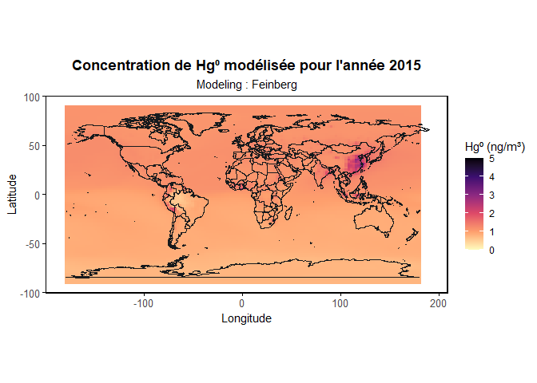

Concentrations modélisées de Hg⁰ vs données de référence
================
Martin Colomb
2025-08-26

# Libraries

``` r
library(dplyr)
library(ggplot2)
library(lubridate)
library(ncdf4)
library(viridis)
library(maps)
library(geosphere)
library(patchwork)
```

# Chemins

``` r
chem_martin <- "C:/Users/colom/Desktop/STAGE/data/clean_mod_data/14_3_1/HIST_V3"
chem_feinberg <- "C:/Users/colom/Desktop/STAGE/data/clean_mod_data/14_3_1/HIST_Feinberg"
chem_ref <- "C:/Users/colom/Desktop/STAGE/data/clean_mod_data/14_3_1/ref_wd_con_hg"
```

# Constantes

``` r
M_Hg <- 200.59
R <- 8.3145
P <- 101325
T <- 298.15
```

# Poids mois

``` r
nc_tmp <- nc_open(file.path(chem_martin, "GEOSChem.SpeciesConc.2015_m.nc4"))
time_raw <- ncvar_get(nc_tmp, "time")
nc_close(nc_tmp)
origin_time <- as.POSIXct("2015-01-01 00:00:00", tz = "UTC")
time <- origin_time + time_raw * 60
days_in_months <- days_in_month(time)
weights <- days_in_months / sum(days_in_months)
```

# Fonctions

``` r
load_hg0_conc <- function(filepath, varname, weights) {
  nc <- nc_open(filepath)
  conc <- ncvar_get(nc, varname)[,,1,]
  nc_close(nc)
  conc <- apply(conc, MARGIN = c(1, 2), FUN = function(x) sum(x * weights))
  conc * P * (M_Hg / (R * T)) * 1e9
}

create_df_conc <- function(matrix_conc, lon, lat) {
  expand.grid(lon = lon, lat = lat) %>%
    mutate(conc = as.vector(matrix_conc))
}

plot_concentration_map <- function(df, title, subtitle, ref_data = NULL, limits = c(0, 5)) {
  p <- ggplot(df, aes(x = lon, y = lat, fill = conc)) +
  geom_raster() +
  scale_fill_viridis_c(option = "magma", name = "Hg⁰ (ng/m³)", direction = -1, limits = limits) +
  coord_fixed() +
  labs(title = title, subtitle = subtitle, x = "Longitude", y = "Latitude") +
  borders("world", colour = "black") +
  theme_minimal() +
  borders("world", colour = "#161a1d", size = 0.1) +
  theme(
    plot.title = element_text(hjust = 0.5, face = "bold"),
    plot.subtitle = element_text(hjust = 0.5),
    axis.text = element_text(size = 10),
    axis.ticks = element_line(color = "black", size = 0.3),
    axis.ticks.length = unit(3, "pt"),
    panel.grid = element_blank(),
    panel.border = element_rect(color = "black", fill = NA, size = 0.8),
    axis.line = element_blank(),
    plot.background = element_rect(fill = "white", color = NA)
  )
  
  
  
  
  if (!is.null(ref_data)) {
    p <- p + geom_point(data = ref_data, aes(x = Lon, y = Lat, fill = Hg0),
                        size = 3, shape = 21, inherit.aes = FALSE)
  }
  return(p)
}
```

# Grilles géo

``` r
lon <- seq(-180, 180, length.out = 144)
lat <- seq(-90, 90, length.out = 91)
```

# Plot concentrations Martin

``` r
conc_martin <- load_hg0_conc(file.path(chem_martin, "GEOSChem.SpeciesConc.2015_m.nc4"), "SpeciesConcVV_Hg0", weights)
df_martin <- create_df_conc(conc_martin, lon, lat)
plot_martin <- plot_concentration_map(df_martin, "Concentration de Hg⁰ modélisée pour l'année 2015","Modeling : Martin", limits = c(0, 4))
plot_martin
```

<!-- -->

# Plot concentrations Feinberg

``` r
conc_feinberg <- load_hg0_conc(file.path(chem_feinberg, "Feinberg_GEOSChem.SpeciesConc.2015_m.nc4"), "SpeciesConc_Hg0", weights)
df_feinberg <- create_df_conc(conc_feinberg, lon, lat)
plot_feinberg <- plot_concentration_map(df_feinberg, "Concentration de Hg⁰ modélisée pour l'année 2015", "Modeling : Feinberg",limits = c(0, 5))
plot_feinberg
```

<!-- -->

# Ajout données ref

``` r
ref_hg0 <- read.csv2(file.path(chem_ref, "Hg0_annual_2013-2015_Apr13_2024.csv"), sep = ",", header = TRUE)
colnames(ref_hg0) <- as.character(unlist(ref_hg0[1, ]))
ref_hg0 <- ref_hg0[-1, ] %>%
  mutate(Lat = as.numeric(Lat),
         Lon = as.numeric(Lon),
         Hg0 = as.numeric(Hg0))
```

# Plot concentrations Martin vs ref

``` r
plot_martin_ref <- plot_concentration_map(df_martin,
  "Annual Hg(0) concentrations in 2015 vs reference", "Modeling : Martin",
  ref_data = ref_hg0, limits = c(0, 5))
plot_martin_ref
```

<!-- -->

``` r
# Chemin de sauvegarde (modifie si nécessaire)
chemin_pdf <- "C:/Users/colom/Desktop/STAGE/data/clean_mod_data/plot/martin_mod_vs_ref.pdf"

# Enregistrement du plot
ggsave(
  filename = chemin_pdf,
  plot = plot_martin_ref,
  device = "pdf",
  width = 10, height = 6, units = "in"
)
```

# Plot concentrations Feinberg vs ref

``` r
plot_feinberg_ref <- plot_concentration_map(df_feinberg,
  "Annual Hg(0) concentrations in 2015 vs reference", "Modeling : Feinberg",
  ref_data = ref_hg0, limits = c(0, 5))
plot_feinberg_ref
```

<!-- -->

``` r
# Chemin de sauvegarde (modifie si nécessaire)
chemin_pdf <- "C:/Users/colom/Desktop/STAGE/data/clean_mod_data/plot/feinberg_mod_vs_ref.pdf"

# Enregistrement du plot
ggsave(
  filename = chemin_pdf,
  plot = plot_feinberg_ref,
  device = "pdf",
  width = 10, height = 6, units = "in"
)
```
