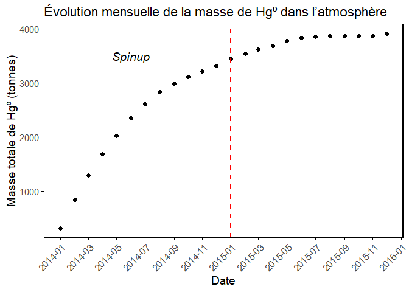

Mercury mass in atmosphere
================
Martin Colomb
2025-06-17

# Chargement des packages

``` r
library(akima)
library(dplyr)
library(ggplot2)
library(lubridate)
library(ncdf4)
library(plotly)
library(RColorBrewer)
library(raster)
library(reshape2)
library(rnaturalearth)
library(rnaturalearthdata)
library(scales)
library(sf)
library(terra)
library(viridis)
library(zoo)
library(patchwork)
library(maps)
library(geosphere)
library(tidyverse)
library(writexl)
```

# Lecture des données

``` r
chem_hist_B100<-"C:/Users/colom/Desktop/STAGE/data/clean_mod_data/14_3_1/HIST_B100"
con_hg_B100<-nc_open(file.path(chem_hist_B100, "GEOSChem.SpeciesConc.2015_m.nc4"))
statemet_B100<-nc_open(file.path(chem_hist_B100, "GEOSChem.StateMet.2015_m.nc4"))


conc_hg0<-ncvar_get(con_hg_B100, "SpeciesConcVV_Hg0") #Concentration of species Hg0 (mol mol-1 dry)

Met_AIRVOL<-ncvar_get(statemet_B100, "Met_AIRVOL")  #Met_AIRVOL (Volume of grid box m3)
Met_AIRDEN<-ncvar_get(statemet_B100, "Met_AIRDEN")  #Met_AIRDEN (Dry air density kg m-3)
Met_AD<-ncvar_get(statemet_B100, "Met_AD")  #Met_AD (Dry air mass kg)


area<-ncvar_get(con_hg_B100, "AREA")
s_in_yr = 365.2425 * 24 * 3600
unit_conv = s_in_yr
kg_Mg = 1e-3
MW_Hg = 200.59
avo = 6.02e23
g_kg = 1e-3
cm2_m2 = 1e4
unit_conv_dd = MW_Hg / avo * g_kg * cm2_m2 * s_in_yr * area
M_Hg <- 0.20059
M_air <- 0.028964
```

# The conversion formula is:

        mol species                g/mol species
        ----------- * kg dry air * -------------
        mol dry air                g/mol dry air

        = volume mixing ratio * dry air mass * MW species / MW dry air

        = kg species
        
            
        MW dry air is defined as 28.9644 g/mol
        https://github.com/geoschem/geos-chem/blob/4722f288e90291ba904222f4bbe4fc216d17c34a/Headers/physconstants.F90#L26

        
        

# Calcul de la masse de mercure dans l’atmosphère sur l’année

``` r
# Moyenne temporelle sur les 12 mois
mean_conc_hg0 <- apply(conc_hg0, c(1,2,3), mean, na.rm = TRUE)
mean_Met_AD <- apply(Met_AD, c(1,2,3), mean, na.rm = TRUE)

# Calcul de la masse de Hg (en kg) dans chaque maille
mass_hg <- mean_conc_hg0 * mean_Met_AD * (M_Hg / M_air)

# Masse totale de Hg dans toute l'atmosphère (somme de toutes les mailles)
total_mass_hg <- sum(mass_hg, na.rm = TRUE)  # en kg
total_mass_hg_tonnes <- total_mass_hg / 1000
print(total_mass_hg_tonnes)
```

    ## [1] 3757.912

``` r
state_files <- list.files(chem_hist_B100, pattern = "GEOSChem.StateMet.*\\.nc4$", full.names = TRUE)
chem_files  <- list.files(chem_hist_B100, pattern = "GEOSChem.SpeciesConc.*\\.nc4$", full.names = TRUE)

# Supprimer les fichiers de moyenne annuelle que l'on ne veut pas traiter
exclude_states <- "GEOSChem.StateMet.2015_m.nc4"
exclude_chems  <- "GEOSChem.SpeciesConc.2015_m.nc4"

state_files <- state_files[!basename(state_files) %in% exclude_states]
chem_files  <- chem_files[!basename(chem_files) %in% exclude_chems]

dates <- c()
masses_tonnes <- c()


for (i in seq_along(state_files)) {
  # Ouvrir fichiers
  nc_statemet <- nc_open(state_files[i])
  nc_chem     <- nc_open(chem_files[i])

  # Lire les variables
  Met_AD    <- ncvar_get(nc_statemet, "Met_AD")            # kg
  conc_hg0  <- ncvar_get(nc_chem,     "SpeciesConcVV_Hg0") # mol/mol

  # Calcul masse
  mass_hg <- conc_hg0 * Met_AD * (M_Hg / M_air)
  total_mass_kg <- sum(mass_hg, na.rm = TRUE)
  total_mass_tonnes <- total_mass_kg / 1000

  # Extraire la date depuis le nom de fichier
  file_date <- str_extract(basename(state_files[i]), "\\d{8}")
  file_date <- as.Date(file_date, format = "%Y%m%d")

  # Stocker résultats
  dates <- c(dates, file_date)
  masses_tonnes <- c(masses_tonnes, total_mass_tonnes)

  # Fermer fichiers
  nc_close(nc_statemet)
  nc_close(nc_chem)
}

df_mass <- tibble(
  date = as.Date(dates),  # forcer ici
  mass_tonnes = masses_tonnes
)
```

# PLOT DE LA MASSE TOTALE DE Hg⁰ (tonnes) PAR MOIS

``` r
ggplot(df_mass, aes(x = date, y = mass_tonnes)) +
 #geom_line(color = "steelblue", size = 1.2) +
  geom_point(color = "black", size = 2) +
  labs(
    title = "Évolution mensuelle de la masse de Hg⁰ dans l’atmosphère",
    x = "Date",
    y = "Masse totale de Hg⁰ (tonnes)"
  ) +
  annotate("text", x = as.Date("2014-06-01"), y = 3500, label = "Spinup", size = 5, fontface = "italic")+
  scale_x_date(
    date_breaks = "2 months",
    date_labels = "%Y-%m"
  ) +
  geom_vline(xintercept = as.Date("2015-01-01"), color = "red", linetype = "dashed", linewidth = 1)+
  theme_classic(base_size = 14) +
  theme(
    axis.line = element_line(color = "black"),
    axis.ticks = element_line(color = "black"),
    axis.text.x = element_text(angle = 45, hjust = 1, vjust = 1),
    panel.border = element_rect(color = "black", fill = NA, linewidth = 0.8)
  )
```

<!-- -->

``` r
print(df_mass)
```

    ## # A tibble: 24 × 2
    ##    date       mass_tonnes
    ##    <date>           <dbl>
    ##  1 2014-01-01        325.
    ##  2 2014-02-01        850.
    ##  3 2014-03-01       1290.
    ##  4 2014-04-01       1683.
    ##  5 2014-05-01       2027.
    ##  6 2014-06-01       2346.
    ##  7 2014-07-01       2613.
    ##  8 2014-08-01       2836.
    ##  9 2014-09-01       2990.
    ## 10 2014-10-01       3114.
    ## # ℹ 14 more rows

``` r
df_2015 <- df_mass[format(df_mass$date, "%Y") == "2015", ]
print(df_2015)
```

    ## # A tibble: 12 × 2
    ##    date       mass_tonnes
    ##    <date>           <dbl>
    ##  1 2015-01-01       3444.
    ##  2 2015-02-01       3539.
    ##  3 2015-03-01       3615.
    ##  4 2015-04-01       3685.
    ##  5 2015-05-01       3768.
    ##  6 2015-06-01       3833.
    ##  7 2015-07-01       3857.
    ##  8 2015-08-01       3866.
    ##  9 2015-09-01       3860.
    ## 10 2015-10-01       3861.
    ## 11 2015-11-01       3865.
    ## 12 2015-12-01       3903.

``` r
mean_begin_2015 <- mean(df_2015$mass_tonnes[1:6])
mean_end_2015 <- mean(df_2015$mass_tonnes[7:12])
mean_2015 <- mean(df_2015$mass_tonnes)

print(paste("Moyenne janvier–juin 2015 :", round(mean_begin_2015, 2), "tonnes"))
```

    ## [1] "Moyenne janvier–juin 2015 : 3647.51 tonnes"

``` r
print(paste("Moyenne juillet–décembre 2015 :", round(mean_end_2015, 2), "tonnes"))
```

    ## [1] "Moyenne juillet–décembre 2015 : 3868.43 tonnes"

``` r
print(paste("Moyenne annuelle 2015 :", round(mean_2015, 2), "tonnes"))
```

    ## [1] "Moyenne annuelle 2015 : 3757.97 tonnes"

``` r
# Constantes
kg_Mg <- 1e-3         # kg to Mg (tonnes)
s_in_yr <- 365 * 24 * 3600  # seconds in a year

# Dossier principal
chem_hist <- "C:/Users/colom/Desktop/STAGE/data/clean_mod_data/14_3_1"

# Lister les sous-dossiers HIST_*
subdirs <- list.dirs(chem_hist, full.names = TRUE, recursive = FALSE)
subdirs <- subdirs[grepl("HIST_", basename(subdirs))]

# Initialiser un tableau pour stocker les résultats
results <- tibble()

for (subdir in subdirs) {
  file_path <- file.path(subdir, "HEMCO_diagnostic_2015_m.nc4")
  
  if (!file.exists(file_path)) next  # skip si fichier manquant
  
  hemco_diagn <- nc_open(file_path)
  
  # Extraire temps et poids mensuels
  time_raw <- ncvar_get(hemco_diagn, "time")
  origin_time <- as.POSIXct("2015-01-01 00:00:00", tz = "UTC")
  time <- origin_time + time_raw * 60
  weights <- days_in_month(time) / sum(days_in_month(time))
  
  # Fonction de moyenne pondérée
  weighted_avg <- function(x) sum(x * weights)
  
  # Aire des cellules
  area <- ncvar_get(hemco_diagn, "AREA")  # en m²

  # Liste des variables d'intérêt
  vars <- list(
    biomass      = "EmisHg0_BioBurn",
    hg0_anthro   = "EmisHg0_Anthro",
    hg2_anthro   = "EmisHg2ClP_Anthro",
    hgp_anthro   = "EmisHgCl2_Anthro",
    geo          = "EmisHg0_Natural",
    asgm         = "EmisHg0_ASGM"
  )
  
  # Stockage temporaire
  row <- list(case = basename(subdir))
  
  for (name in names(vars)) {
    varname <- vars[[name]]
    emis <- ncvar_get(hemco_diagn, varname)  # [lon, lat, time]
    emis_avg <- apply(emis, c(1, 2), weighted_avg)
    total <- sum(emis_avg * area * s_in_yr * kg_Mg, na.rm = TRUE)
    row[[name]] <- total
  }
  
  # Ajouter les calculs additionnels
  row$total_hg0      <- row$hg0_anthro + row$asgm
  row$total_hg2_hgp  <- row$hg2_anthro + row$hgp_anthro
  
  # Ajouter au tableau final
  results <- bind_rows(results, as_tibble(row))
  
  nc_close(hemco_diagn)
}

print(results)
```

    ## # A tibble: 6 × 9
    ##   case      biomass hg0_anthro hg2_anthro hgp_anthro   geo  asgm total_hg0 total_hg2_hgp
    ##   <chr>       <dbl>      <dbl>      <dbl>      <dbl> <dbl> <dbl>     <dbl>         <dbl>
    ## 1 HIST_B05     275.       987.       89.2       310.  250.  838.     1825.          399.
    ## 2 HIST_B10     275.       987.       89.2       310.  250.  838.     1825.          399.
    ## 3 HIST_B100    275.       987.       89.2       310.  250.  838.     1825.          399.
    ## 4 HIST_B150    275.       987.       89.2       310.  250.  838.     1825.          399.
    ## 5 HIST_B200    275.       987.       89.2       310.  250.  838.     1825.          399.
    ## 6 HIST_V4_2    275.       987.       89.2       310.  250.  838.     1825.          399.

``` r
results_mercuryemis <- tibble()

for (subdir in subdirs) {
  file_path <- file.path(subdir, "GEOSChem.MercuryEmis.alltime_m.nc4")
  
  if (!file.exists(file_path)) next
  
  merc_emiss <- nc_open(file_path)
  
  # Temps et poids mensuels
  time_raw <- ncvar_get(merc_emiss, "time")
  origin_time <- as.POSIXct("2015-01-01 00:00:00", tz = "UTC")
  time <- origin_time + time_raw * 60
  weights <- days_in_month(time) / sum(days_in_month(time))
  weighted_avg <- function(x) sum(x * weights)
  
  # Emissions
  hg0land <- ncvar_get(merc_emiss, "EmisHg0land")  # [lon, lat, time]
  hg0soil <- ncvar_get(merc_emiss, "EmisHg0soil")

  # Calculs
  hg0land_mean <- apply(hg0land, c(1, 2), weighted_avg)
  hg0soil_mean <- apply(hg0soil, c(1, 2), weighted_avg)
  
  total_hg0land <- sum(hg0land_mean) * s_in_yr * kg_Mg
  total_hg0soil <- sum(hg0soil_mean) * s_in_yr * kg_Mg
  
  # Ajouter au tableau
  results_mercuryemis <- bind_rows(results_mercuryemis, tibble(
    case = basename(subdir),
    hg0land = total_hg0land,
    hg0soil = total_hg0soil
  ))
  
  nc_close(merc_emiss)
}

print(results_mercuryemis)
```

    ## # A tibble: 5 × 3
    ##   case      hg0land hg0soil
    ##   <chr>       <dbl>   <dbl>
    ## 1 HIST_B05    134.     839.
    ## 2 HIST_B10     61.8    839.
    ## 3 HIST_B100    52.5    839.
    ## 4 HIST_B150    49.3    839.
    ## 5 HIST_B200    47.0    839.

``` r
subdirs <- list.dirs(chem_hist, full.names = TRUE, recursive = FALSE)
subdirs <- subdirs[grepl("HIST_", basename(subdirs))]

# Initialiser les résultats
results_drydep <- tibble()

# Fonction de moyenne pondérée
weighted_avg <- function(x, weights) sum(x * weights)

# Boucle sur les cas
for (subdir in subdirs) {
  file_path <- file.path(subdir, "GEOSChem.DryDep.2015_m.nc4")
  if (!file.exists(file_path)) next
  
  drydep_nc <- nc_open(file_path)
  
  # Temps
  time_raw <- ncvar_get(drydep_nc, "time")
  origin_time <- as.POSIXct("2015-01-01 00:00:00", tz = "UTC")
  time <- origin_time + time_raw * 60
  days_in_months <- days_in_month(time)
  weights <- days_in_months / sum(days_in_months)
  
  # Extraction et traitement des 3 espèces
  get_drydep_sum <- function(varname) {
    var <- ncvar_get(drydep_nc, varname)
    var <- apply(var, c(1, 2), weighted_avg, weights = weights)
    var <- var * unit_conv_dd * kg_Mg
    sum(var, na.rm = TRUE)
  }
  
  DryDep_Hg0_hist <- get_drydep_sum("DryDep_Hg0")
  DryDep_Hg2_hist <- get_drydep_sum("DryDep_Hg2")
  DryDep_HgP_hist <- get_drydep_sum("DryDep_HgP")
  
  # Stocker
  results_drydep <- bind_rows(results_drydep, tibble(
    case = basename(subdir),
    drydep_Hg0_tonnes = DryDep_Hg0_hist,
    drydep_Hg2_tonnes = DryDep_Hg2_hist,
    drydep_HgP_tonnes = DryDep_HgP_hist
  ))
  
  nc_close(drydep_nc)
}

# Afficher les résultats
print(results_drydep)
```

    ## # A tibble: 7 × 4
    ##   case      drydep_Hg0_tonnes drydep_Hg2_tonnes drydep_HgP_tonnes
    ##   <chr>                 <dbl>             <dbl>             <dbl>
    ## 1 HIST_B05              1576.             1112.              46.6
    ## 2 HIST_B10              2174.              801.              65.0
    ## 3 HIST_B100             2242.              747.              67.8
    ## 4 HIST_B150             2265.              728.              68.8
    ## 5 HIST_B200             2282.              713.              69.6
    ## 6 HIST_V3               2162.              810.              64.5
    ## 7 HIST_V4_2             1576.             1112.              46.6

``` r
# Sous-dossiers HIST_*
subdirs <- list.dirs(chem_hist, full.names = TRUE, recursive = FALSE)
subdirs <- subdirs[grepl("HIST_", basename(subdirs))]

# Initialiser le tableau des résultats
results_wetloss <- tibble()

# Fonction de moyenne pondérée
weighted_avg <- function(x, weights) sum(x * weights)

# Boucle sur les cas
for (subdir in subdirs) {
  file_path <- file.path(subdir, "GEOSChem.WetLossTot_HgSum.2015_m.nc4")
  if (!file.exists(file_path)) next
  
  wetloss_nc <- nc_open(file_path)
  
  # Temps
  time_raw <- ncvar_get(wetloss_nc, "time")
  origin_time <- as.POSIXct("2015-01-01 00:00:00", tz = "UTC")
  time <- origin_time + time_raw * 60
  days_in_months <- days_in_month(time)
  weights <- days_in_months / sum(days_in_months)
  
  # Extraction et traitement
  wetloss_array <- ncvar_get(wetloss_nc, "WetLossTot_HgSum")
  wetloss_array <- apply(wetloss_array, c(1, 2), weighted_avg, weights = weights)
  wetloss_total_tonnes <- sum(wetloss_array * s_in_yr * kg_Mg, na.rm = TRUE)
  
  # Stocker
  results_wetloss <- bind_rows(results_wetloss, tibble(
    case = basename(subdir),
    wetloss_Hg_total_tonnes = wetloss_total_tonnes
  ))
  
  nc_close(wetloss_nc)
}

# Afficher les résultats
print(results_wetloss)
```

    ## # A tibble: 7 × 2
    ##   case      wetloss_Hg_total_tonnes
    ##   <chr>                       <dbl>
    ## 1 HIST_B05                    2865.
    ## 2 HIST_B10                    1818.
    ## 3 HIST_B100                   1724.
    ## 4 HIST_B150                   1694.
    ## 5 HIST_B200                   1672.
    ## 6 HIST_V3                     1835.
    ## 7 HIST_V4_2                   2865.

``` r
file_path <- "C:/Users/colom/Desktop/STAGE/data/clean_mod_data/14_3_1/HIST_B10/GEOSChem.WetLossTot_HgSum.2015_m.nc4"
wetloss_nc <- nc_open(file_path)

# Extraire le temps
time_raw <- ncvar_get(wetloss_nc, "time")
origin_time <- as.POSIXct("2015-01-01 00:00:00", tz = "UTC")
time <- origin_time + time_raw * 60  # en secondes
days_in_months <- days_in_month(time)
weights <- days_in_months / sum(days_in_months)

# Extraire la variable et appliquer la moyenne pondérée sur le temps
wetloss_array <- ncvar_get(wetloss_nc, "WetLossTot_HgSum")
wetloss_array_avg <- apply(wetloss_array, c(1, 2), function(x) sum(x * weights))

# Calcul total en tonnes
wetloss_total_tonnes <- sum(wetloss_array_avg * s_in_yr * kg_Mg, na.rm = TRUE)

# Fermer le fichier NetCDF
nc_close(wetloss_nc)

# Afficher le résultat
print(wetloss_total_tonnes)
```

    ## [1] 1817.926

``` r
# Fusionner les tables selon la colonne commune "case"
results_all <- results_wetloss %>%
  full_join(results_drydep, by = "case") %>%
  full_join(results_mercuryemis, by = "case") %>%
  full_join(results, by = "case")

# Écrire dans un fichier Excel
write_xlsx(results_all, "C:/Users/colom/Desktop/STAGE/data/clean_mod_data/14_3_1/resultats_mercury.xlsx")
```
